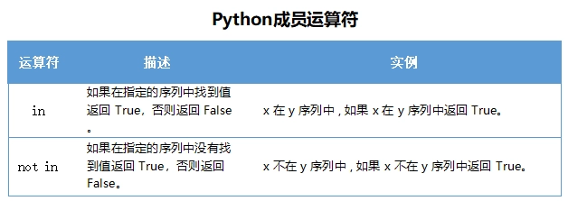
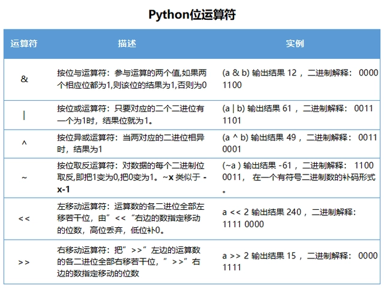
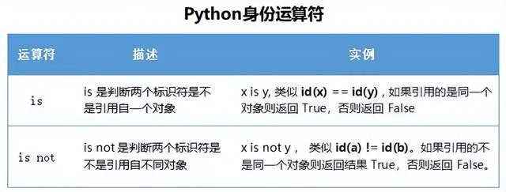
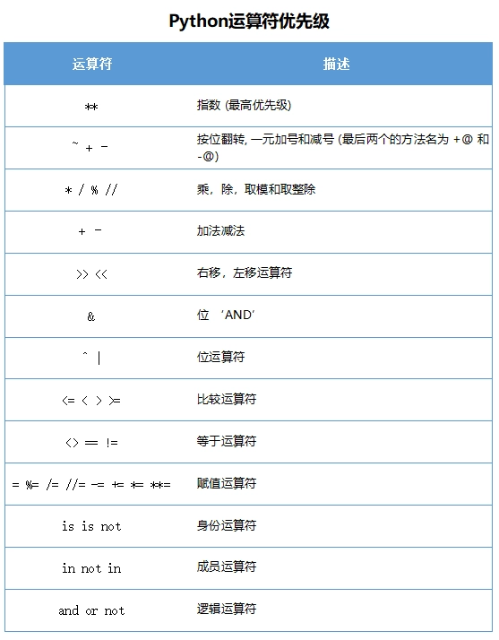

### print函数

#### 1. 输出到文件中
~~~python
fp=open('文件路径'，'打开方式')
print('要输入的内容'，file=fp)
fp.close() 
~~~
#### 2. 连续在一行输出多个字符串
```python
print('hello','world','python')
```
---

### 变量定义及使用
```python
print(id(name))              #输出变量name的内存地址
print(type(name))            #输出变量name的数据类型
print(name)                  #输出变量name的值
```
---


### 数据类型转换
##### 1. str() 将其他数据类型转换为字符串
##### 2. int()将其他数据类型转换成整型
    .无法将文字，小数类字符串转化
    .浮点类转化会抹零取整
##### 3. float()将其他类型转化成浮点型
    .文字类无法转化成浮点型


### 运算符
#### 1. 布尔运算符
and->'&'    
or->'|'
not->'~' 
in \not in 判断元素是否存在于元组，字符串中
#### 2. 成员运算符

#### 3. 位运算符

#### 4. 身份运算符

### 运算符优先级


### 循环语句
#### 1. for循环语句
```python
for i in 'hello'                 #hello为可迭代对象
print(i)
for _ in range(5)                #如果在循环体中不使用到自定义变量，可以将自定义变量写为‘_’
print('hello')                   #循环体中代码将会将会循环5次
```
#### 2. while循环语句
```python
while i < 5  ：
    循环体
    i+=1
```
