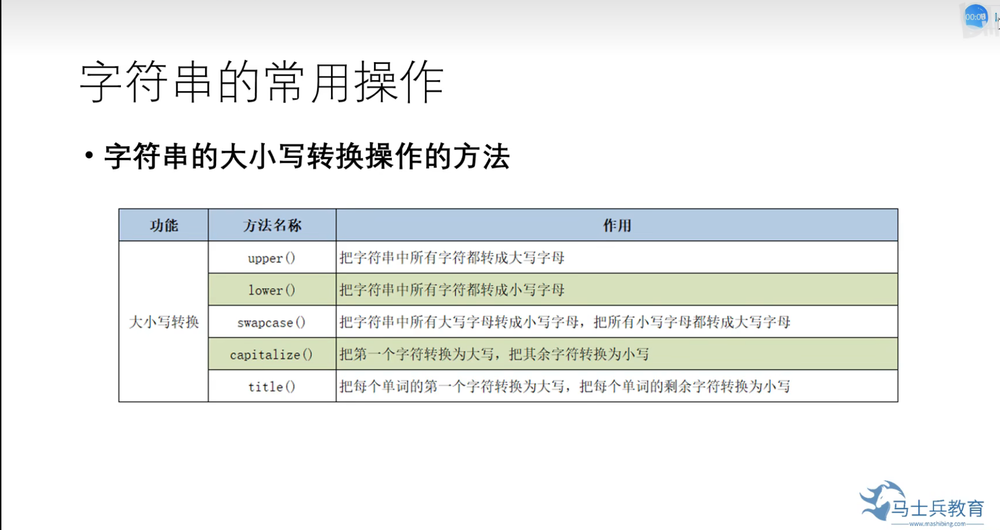

[TOC]
# <center>python数据类型
---

## 列表
### 1. 列表的创建

### 2.列表的特点

### 3. 列表查询
#### a. 查询单个元素

==注：==
```python
list.index['hello',1,3]         #可设置查找范围，但区间为左闭右开
```
#### b.查询多个元素(切片)

#### c. 列表元素的判断及遍历

### 4. 列表元素增删
#### a. 列表元素增添

#### b. 列表元素删除

==注：==
```python
list[1:3]=[]        #切片替换，删除元素后，不会产生新列表
```
### 5. 列表元素修改
```python
list[2]=10
```
### 6. 列表排序
```python
list.sort()                 #默认为升序排序，不产生新的列表

list.sort(reverse=Ture)     #降序排序
list.sort(reverse=False)    #升序排序

new_list=sorted(list)       #默认升序排序，会产生新的列表
new_list=sorted(list,reverse=Ture)#降序排序
```
### 7.列表生成式


---
## 字典
### 1. 字典的创建

### 2. 字典元素的获取

### 3. 字典元素增删

### 4.字典的视图操作

### 5. 字典元素的遍历

### 6. 字典的特点

### 7. 字典生成式


---
## 元组
### 1. 元组的特点

### 2. 元组的创建

### 3. 元组的遍历

### 4. 元组不可变的原因


--- 
## 集合
### 1. 集合的特点

#### a.元素不重复
#### b.元素乱序
### 2. 集合的创建

==注：==
不可用如下方法创建空集合
s1={}
需用s1=set()
### 3. 集合元素的增删

### 4。 集合间的关系

### 5. 集合的数据操作
```python
# a.交集操作
print(s1.intersection(s2))
print(s1&s2)

# b.并集操作
print(s1.union(s2))
print(s1|s2)

# c.差集操作
print(s1.difference(s2))
print(s1-s2)

# d.对称差集操作
print(s1.symmetric_difference(s2))
print(s1^s2)
```
### 集合生成式


---
## 字符串
### 1. 字符串的驻留机制


### 2. 字符串的查询操作

### 3. 字符串的大小写转换操作

### 4. 字符串内容对齐操作

### 5. 字符串劈分操作

### 6. 字符串判断操作

### 7. 字符串合并操作

### 8. 字符串比较操作

==注：== == 和 is 的区别 
**== 比较的是 value
is 比较的是 id 是否相等**
### 9. 字符串的切片操作

### 10. 格式化字符串

```python
name='neil'
age=20

#字符串格式化的3种写法
print('我叫%s，今年%d岁了'%(name,age))
print('我叫{0}，今年{1}岁了'.format(name,age))
print(f"我叫{name}，今年{age}岁了")          #补充写法

##注意
##显示浮点数时,占位符写法
print('{0:.3f}'.format(3.1415926))
```
### 11. 字符串的编码与解码

```python
s='I am Neil'
#编码
byte=s.encode(encoding="GBK")
#解码
byte.decode(encoding="GBK")
```